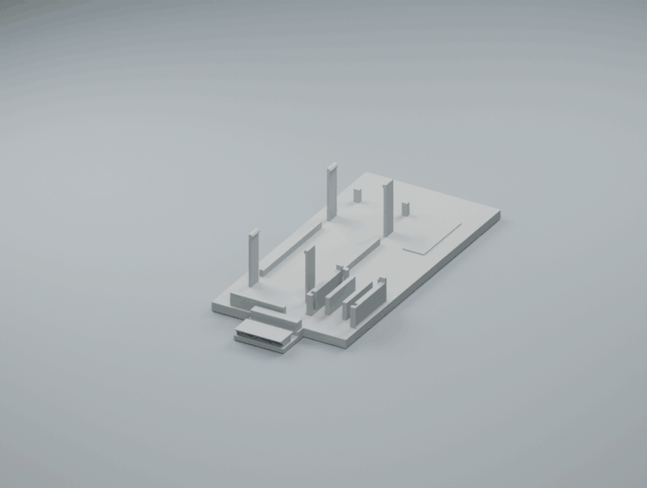

# Team 2 · Cardboard Camera

The battery is optional; the module can run on USB power. The outer shell is up to your group—get creative with its shape, materials and decoration!

## Assembly

[Watch / download video](media/Assembly.mp4)

## Print files

[Sled](design/cardboard-camera/Electronics%20Sled.stl) · [ESP lock](design/cardboard-camera/ESP%20Lock.stl) · [Radar holder](design/cardboard-camera/Radar%20Holder.stl) · [Front cover](design/cardboard-camera/Front%20Cover.stl)

[Assembly & wiring instructions](docs/BUILD_GUIDE.md)
